# 🏢 Digital Center : Your gateway to advanced computing resources.
.png>)
### 📌 Project Overview
**Digital Center** is a professional web application built with **Laravel 12.x**, designed for the seamless management of enterprise IT resources. It allows students and researchers to browse high-end hardware, manage reservations through an interactive calendar, and provides administrators with a robust suite of tools for inventory control and maintenance tracking.

## 📖 Project Documentation

For a detailed technical analysis, including the database schema, system architecture (MVC), and complete functional overview, please refer to the official project report:

👉 **[Read the Full Project Report (Google Docs)](https://docs.google.com/document/d/1OSgUkANkaeluCtigevD-tw7iFbGHAKj6h0wnrjkiNDU/edit?usp=sharing)**

### Report Highlights:
* [cite_start]**Database Modeling (MLD):** Detailed breakdown of entity relationships for the resources.
* [cite_start]**System Architecture:** Deep dive into the Laravel MVC file structure and custom middleware.
* [cite_start]**Technical Choices:** Justification for using Laravel 12.x, PHP 8.2+, and MySQL.
* [cite_start]**Future Perspectives:** Roadmap for PDF reporting and API RESTful integration.
---
## 🎥 Video Demonstration

Check out the full walkthrough of the **Digital Center** application, covering the authentication flow, resource reservation, and the Manager's dashboard.

[]((https://youtu.be/eO7RSLNeD8k))


### ✨ Features

* 🔐 **User Authentication:** Secure login & registration with role-based redirection.
* 🎭 **Role-Based Access Control (RBAC):** Distinct permissions for **Admins**, **Managers**, and **Students**.
* 📅 **Custom Reservation System:** A tailor-made calendar widget for precise date-range selection.
* 🛠 **Inventory Management:** Complete CRUD suite for hardware assets, including real-time "Maintenance Mode" toggling.
* 🔔 **Live Notifications:** Feedback system for reservation approvals, rejections, and account activation.
* 📨 **AJAX Reclamation System:** Interactive modal for users to report technical issues directly to managers.
* 📁 **Asset Storage:** Centralized image handling using Laravel’s filesystem and symbolic linking.

---

### 🖥️ Presentation of the Project

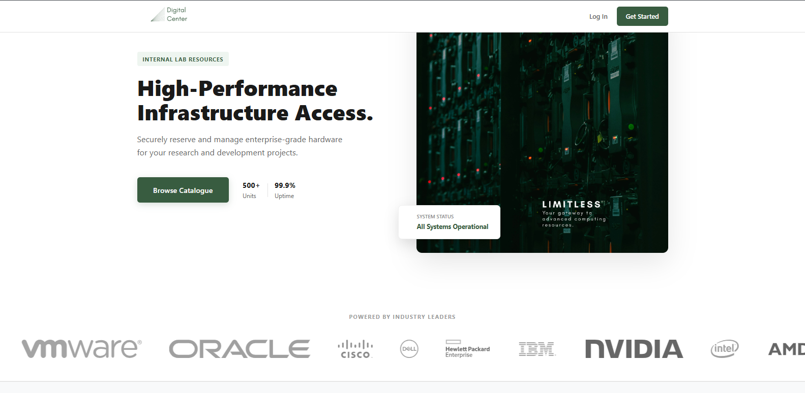

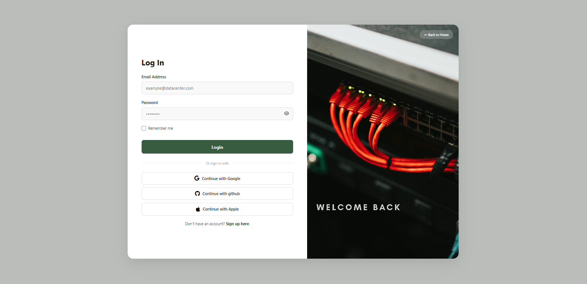

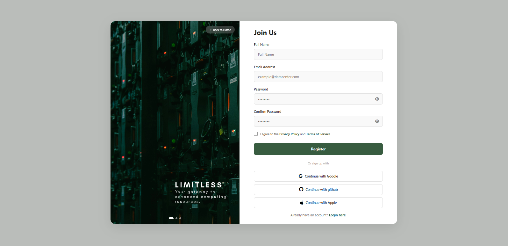


*The gateway to the infrastructure.*
* A **Pro-Navbar** with dynamic links based on user role.
* A **Grid Layout** showcasing 70+ real-world enterprise products (Dell, Cisco, HPE).
* **Status Badges:** Visual indicators for "Available" vs "Maintenance" states.

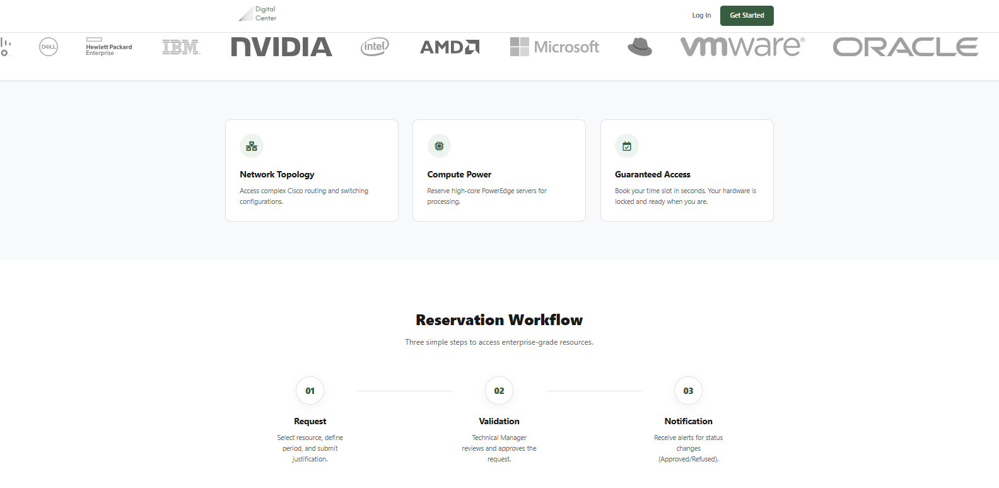
**catalogue**

**guest view** 
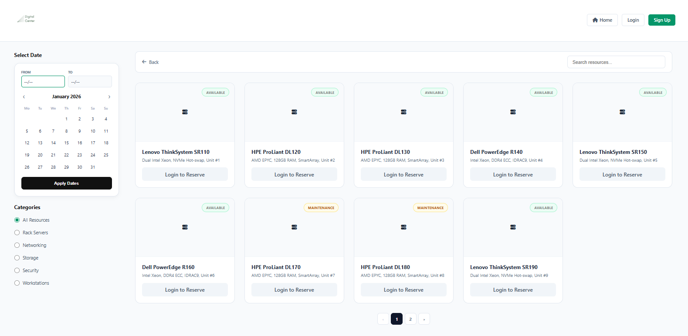

**Internal user pending account view**
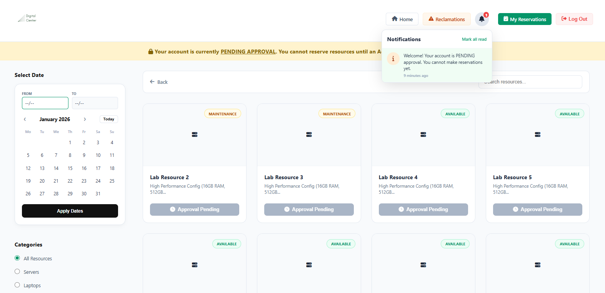

**Internal user verified account view**
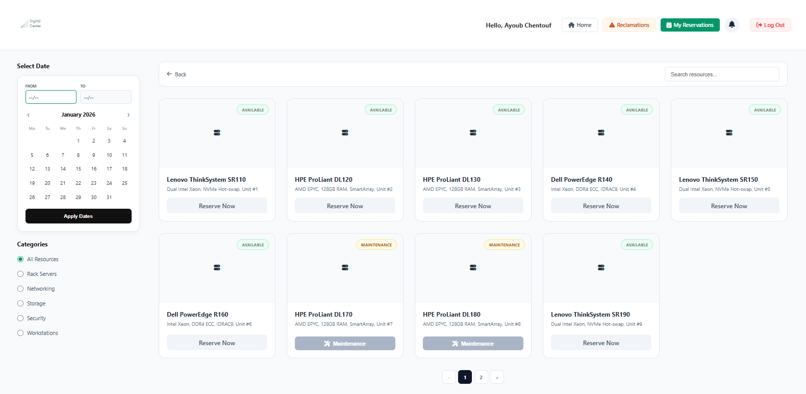
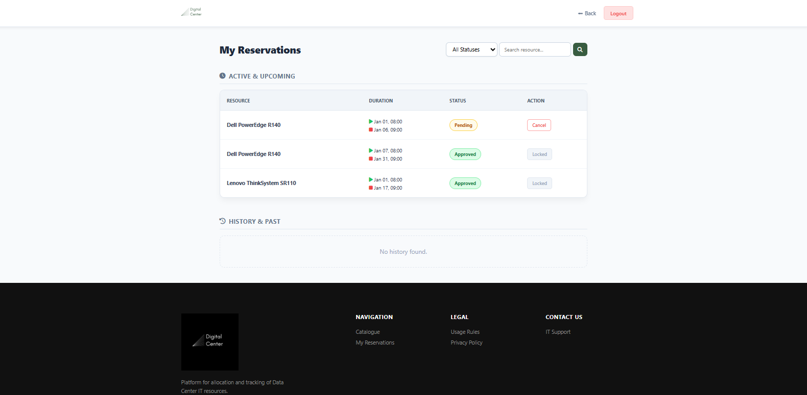


#### **Resource Management (Admin/Manager)**
*The control center for the Data Center inventory.*
* A structured **Data Table** displaying all hardware assets.
* Quick actions for **Editing**, **Deleting**, or **Flagging** items for repair.
* Pagination handled on the server side for optimized performance.

**Manager Dashboard**


**Admin Dashboard**
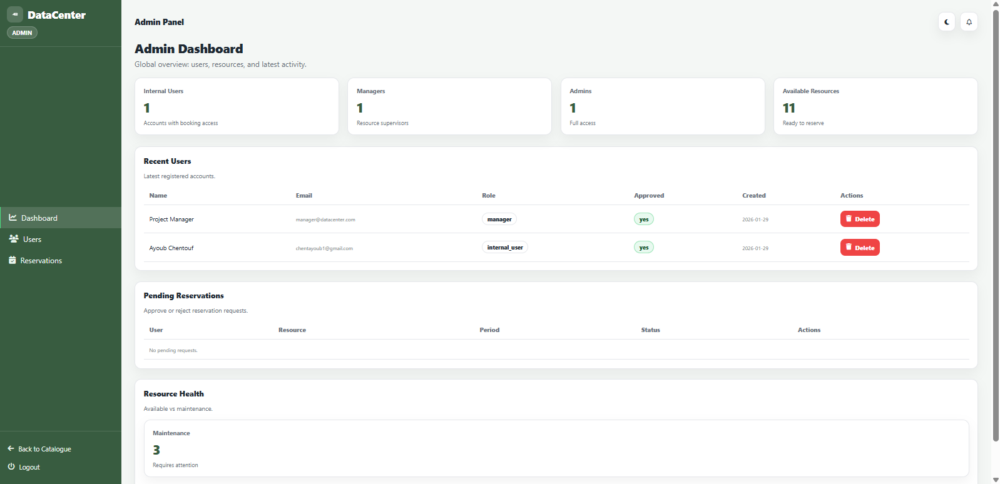

#### **Edit & Create Resource**
* Secure forms with **Multi-part Form Data** support for image uploads.
* Category selection via dynamic dropdowns linked to the database.

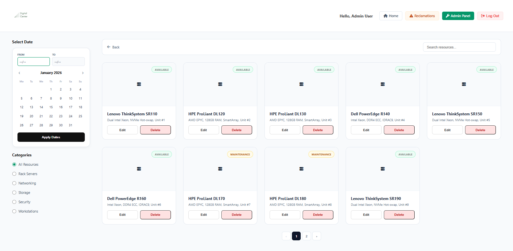
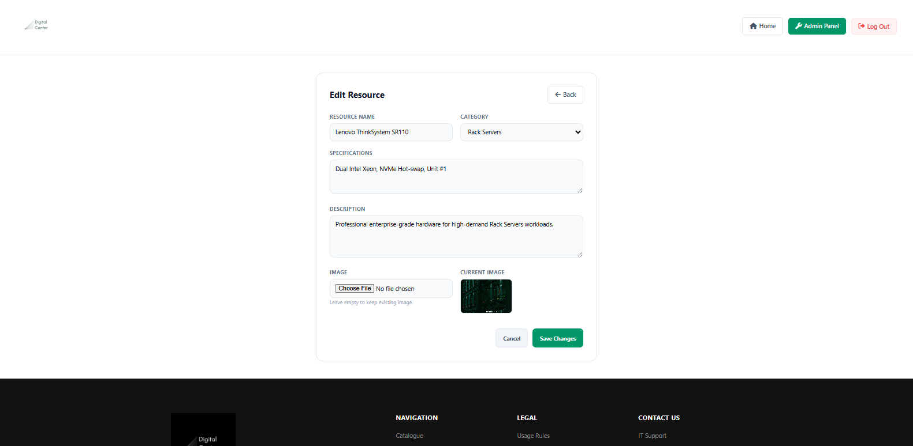

#### **Custom Reservation Calendar**
* An interactive **Sidebar Widget** allowing users to pick "From" and "To" dates.
* Logic to prevent reservations of items currently marked for maintenance.

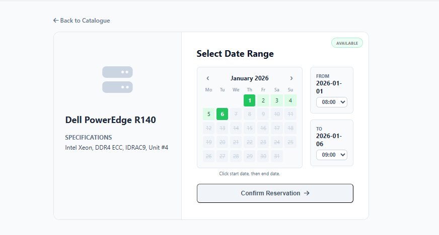
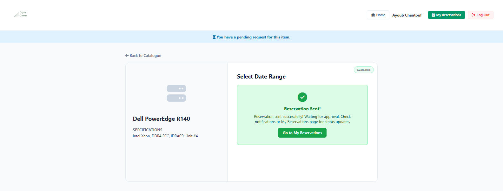

#### **Reclamation & Support Modal**
* A clean **Overlay Modal** for submitting support tickets.
* Fields for Subject, Category, Priority, and Message to ensure clear communication.

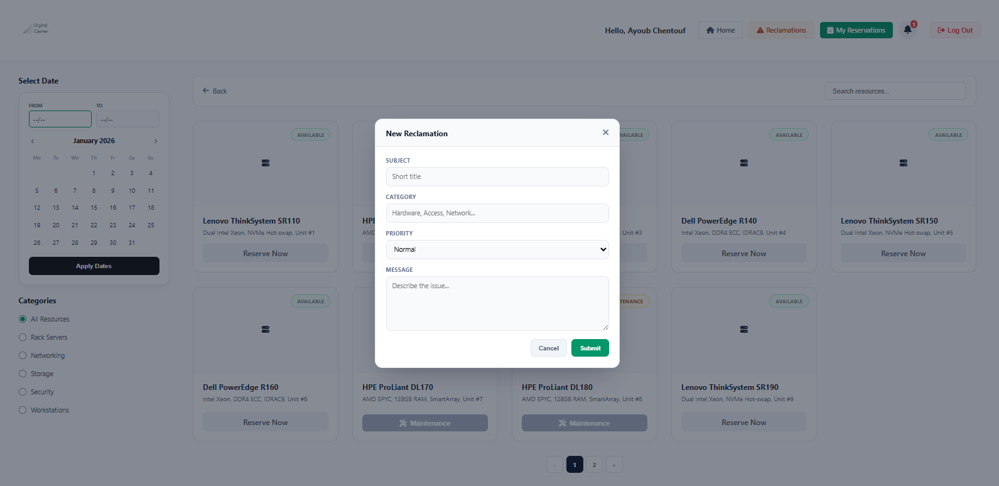

---

### 🏗️ Technical Architecture

The project leverages the **Model-View-Controller (MVC)** pattern to ensure scalability:
* **Eloquent ORM:** Manages complex relationships between `Users`, `Resources`, `Categories`, and `Reservations`.
* **Middleware:** Custom security layers to protect Admin and Manager routes.
* **Database Seeders:** Automated generation of 70+ unique enterprise products.


---

### 🚀 Installation Guide

#### **Prerequisites**
Ensure you have the following installed:
* **PHP 8.2+** & **Composer**
* **MySQL**
* **Node.js & NPM**

#### **Setup Instructions**

1. **Clone the repository:**
    ```bash
        git clone [https://github.com/your-username/DataCenterApp.git](https://github.com/your-username/DataCenterApp.git)
        cd DataCenterApp

2. **Install dependencies:**
    ```bash
        composer install
        npm install && npm run build

3. **Configure environment:**
    ```bash
        cp .env.example .env
        php artisan key:generate

4. **Database setup**
    ```bash
        php artisan migrate:fresh --seed --seeder=ResourceSeeder

5. **Link storage for images:**
    ```bash
        php artisan storage:link

6. **Install dependencies:**
    ```bash
        php artisan serve

### 🎓 Project Supervised By:
* M. Aitkbir Mhamed
* M. Elyussufi Yassyn

---

### 🔥 Challenges Faced
* Security in Role Management: Ensuring only authorized users can access specific features like the Admin Panel.
* Database Constraints: Managing ENUM types for reservation statuses and handling data truncation during migrations.
* Content Access Control: Managing hardware resources dynamically based on user roles and account approval status.

---

### 🚀 Future Enhancements
* Automated Role Testing: Improve security testing for access control layers.
* Subscription Analytics: Provide insights into hardware usage and engagement.
* API Support: Allow third-party integrations for monitoring tool updates.

---

### 📜 License
This project is licensed under the MIT License.

### 👥 Credits
Developed by:
* [Ayoub Chentouf]
* [Ayoub hmamouchi]
* [Charaf Eddine Ifrinchaou]
* **GRP 14**
